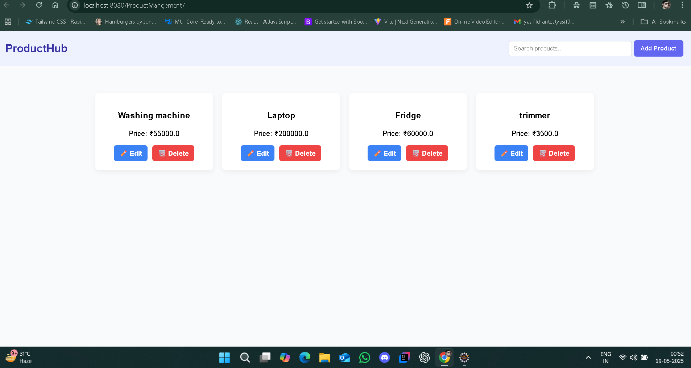
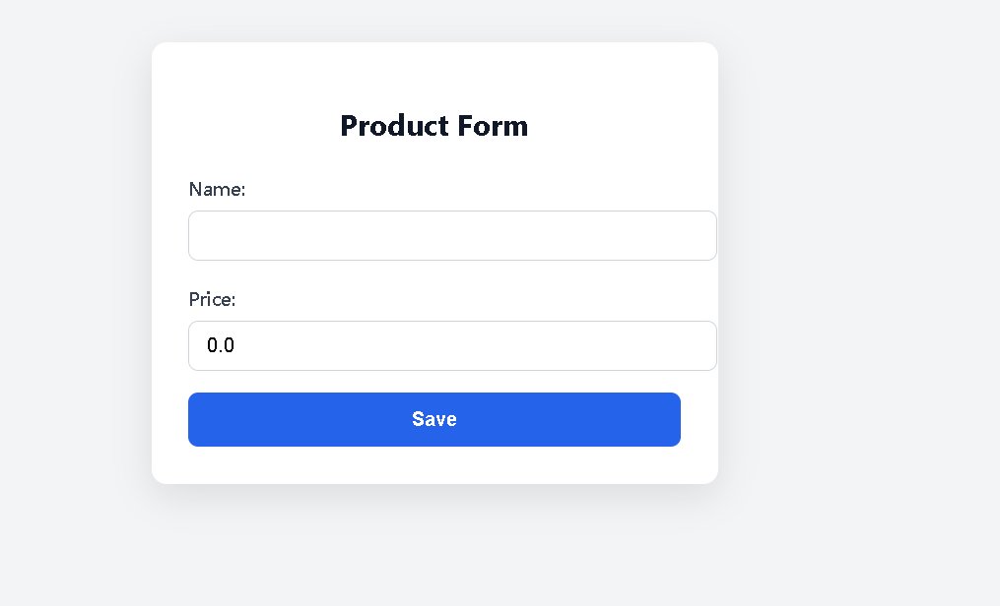
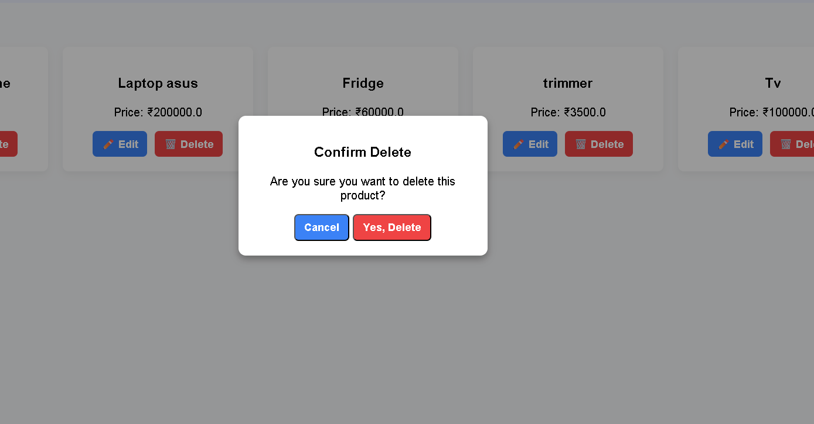
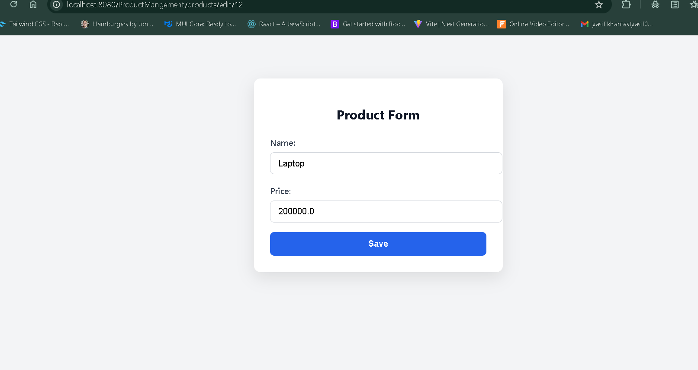

# 🛒 Product Management Web Application

A full-featured **Spring MVC** web application for managing products using **Hibernate ORM**, **MySQL**, and **JSP with JSTL**. This project demonstrates CRUD operations, pagination, filtering, modals, and toast notifications — all with a modern UI/UX design.

---

## 🚀 Features

- 🔍 **Search & Filter Products:** Quickly search for products by name.
- 📄 **Paginated Product List:** View products in a neat, paginated table.
- ➕ **Add/Edit/Delete Product:** Easily manage products (with modal confirmations for delete actions).
- ⚡ **Toast Notifications:** User-friendly notifications for every action.
- ✅ **Java-Based Configuration:** No XML – pure Java config for Spring MVC.
- 🛠 **Hibernate Integration:** Seamless ORM with MySQL.

---

## 🧰 Tech Stack

| **Layer**    | **Technology**           |
|--------------|--------------------------|
| **Backend**  | Java, Spring MVC         |
| **ORM**      | Hibernate                |
| **Database** | MySQL                    |
| **Frontend** | JSP, JSTL, CSS (custom/Bootstrap-like) |
| **Build**    | Maven                    |
| **IDE**      | Eclipse                  |

---

## 📸 Screenshots
Here's a preview of the product dashboards:

				add/DashBoard/delete Product
					
 <p>
  
</p>
 
 <p>
  
</p>  

<p>
  
</p>

				 Edit/List of Product

<p>
  
</p>

 <p>
  
</p>


## ⚙️ Setup Instructions

1. **Clone the Repo**
   ```bash
   git clone https://github.com/Ashh26/product-management.git
